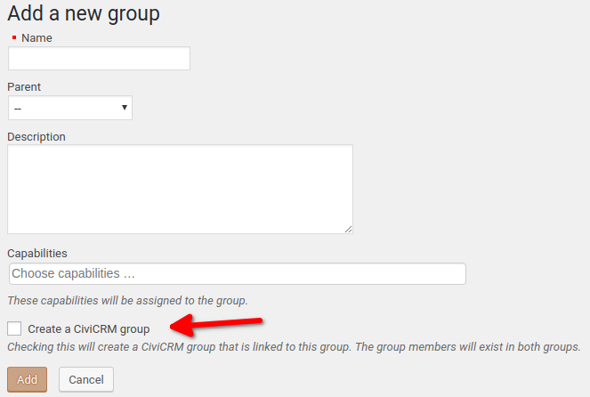
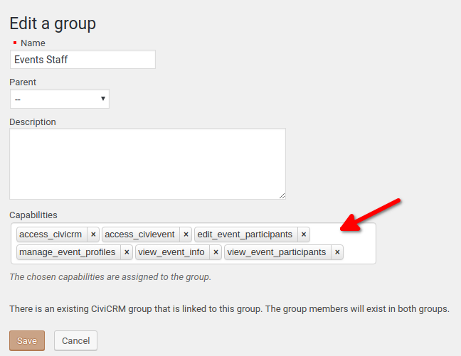
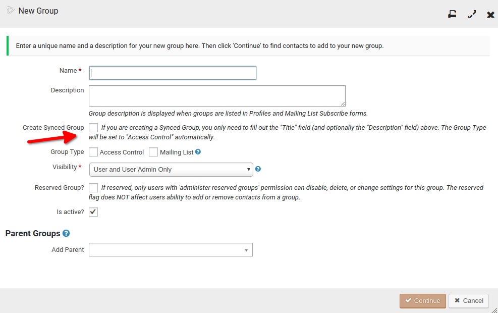

# Integrate CiviCRM with Groups

**Contributors:** [needle](https://profiles.wordpress.org/needle/) [kcristiano](https://profiles.wordpress.org/kcristiano/) 
**Donate link:** https://www.paypal.me/interactivist 
**Tags:** civicrm, groups, sync 
**Requires at least:** 4.9 
**Tested up to:** 6.8 
**Stable tag:** 1.0.0a 
**License:** GPLv2 or later 
**License URI:** https://www.gnu.org/licenses/gpl-2.0.html

Integrates CiviCRM Groups with Groups provided by the Groups plugin.

## Description

Please note: this is the development repository for *Integrate CiviCRM with Groups*.

*Integrate CiviCRM with Groups* is a WordPress plugin that integrates CiviCRM Groups with Groups provided by the [Groups](https://wordpress.org/plugins/groups/) plugin.

### Requirements

This plugin requires a minimum of *WordPress 4.9*, *Groups 2.5* and *CiviCRM 5.8*.

## Installation

There are two ways to install from GitLab:

### ZIP Download

If you have downloaded *Integrate CiviCRM with Groups* as a ZIP file from the git repository, do the following to install and activate the plugin:

1. Unzip the .zip file and, if needed, rename the enclosing folder so that the plugin's files are located directly inside `/wp-content/plugins/wpcv-civicrm-groups-integration`
2. Activate the plugin (in multisite, network activate)
3. You are done!

### git clone

If you have cloned the code from the git repository, it is assumed that you know what you're doing.

## Notes

### WordPress Users

By default, this plugin does not create a WordPress User when a CiviCRM Contact is added to a CiviCRM Group which is synced to a *Groups* Group. If you wish to do so, use a callback from the `wpcv_cgi/wp/user_id` filter to create a new WordPress User and return the User ID.

### CiviCRM Contacts

By default, this plugin does not create a CiviCRM Contact when a WordPress User is added to a *Groups* Group which is synced to a CiviCRM Group. If you wish to do so, use a callback from the `wpcv_cgi/civicrm/contact_id` filter to create a new CiviCRM Contact and return the Contact ID.

### BuddyPress compatibility

If you are using both *BuddyPress* and *Groups* then you will also need [this plugin](https://github.com/itthinx/groups-buddypress-compatibility) in order to prevent conflicts between the two identically-named actions in these plugins.

### Permissions Sync

If you want to have manual control over syncing permissions from CiviCRM to *Groups*, you can apply [this patch](https://github.com/civicrm/civicrm-wordpress/pull/279) to your CiviCRM install.

## Usage

### WordPress Groups

When you add a Group in WordPress, you'll be able to select an option that also creates a Group in CiviCRM. This allows you to update a User in a WordPress Group and it will update that Contact in CiviCRM and add them to the CiviCRM Group.

With the Groups in WordPress, you'll be also be able to assign capabilities or ACLs so that Users in that Groups can access the parts of CiviCRM they can work on.

Tip: Add Users as WordPress using the default User Roles, like Subscriber or Author. Then add them to the appropriate Group to get the ACLs needed to access CiviCRM.

### CiviCRM Groups

When adding a Group in CiviCRM, there will be an option to also create a Group in WordPress. These Groups are all Access Control Groups, since capabilities can be assigned to the Groups, as referenced above.

## Keeping your Groups in sync

It seems that there can be situations which cause the Groups to get out of sync. To address this, there are three options that you can use:

1. A pair of WP-CLI commands
1. A WordPress scheduled event
1. A "Manual Sync" settings page

When using these options, you will need to choose your sync direction depending on whether your CiviCRM Groups or your "Groups" Groups are the "source of truth".

### WP-CLI commands

Use either `wp cvgrp job sync-to-wp` or `wp cvgrp job sync-to-civicrm` to sync all Groups each time the job runs.

### WordPress scheduled event

The "Groups Sync" settings page enables you to set up a scheduled event to keep your Groups in sync.

### "Manual Sync" page

Use the utilities on this page to sync your Groups immediately.

